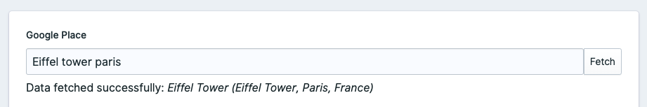

<!-- statamic:hide -->


# Statamic Google Places Field

<!-- /statamic:hide -->

A Google Places addon for Statamic V4 that fetch and store data from Google Places API.

# Installation

You can search for this addon in the `Tools > Addons` section of the Statamic control panel and click **install**, or run the following command from your project root:

```bash
composer require plugrbase/statamic-google-places-field
```

Optionally publish the config file of this package:

```bash
php artisan vendor:publish --provider="Plugrbase\GooglePlacesField\ServiceProvider"
```

Add an environment variable. Provide the Google API key that you want to use for this project.

```
GOOGLE_MAPS_API_KEY=""
```

# Fieldtype

This addon will add a new fieldtype named "Google Place". Once added, you'll have access to the following field:



This new field allow you to fetch data from the Google Places API by providing a "place ID" or a "search string". If the API does returns any data, you'll receive a confirmation message with some basic informations. 

Once the data are fetched and saved, you'll be able to access the data related to the place with the tag mentionned below.

# Available Tags

Insert the tags below into your antlers template.

## Place data

```
{{ g_place_data data="{ google_place.content }" }} ... {{ /g_place_data }}
```

### Parameter(s)

* `data` — The data fetched from the Google Places API.

### Example

```php
{{ g_place_data data="{ google_place.content }" }}
    {{ adr_address }}
    {{ business_status }}
{{ /g_place_data }}
```

See [Google's Official documentation](https://developers.google.com/maps/documentation/places/web-service/search-find-place) for more information on all available data. 

NB: The input type 'textquery' is used by default and can't be modified.

## Place name

This tag return the name provided in the "Google place" field in the admin.

```
{{ google_place.name }}
```

## Place raw data

This tag return the raw data fetched from the Google Places API.

```
{{ google_place.content }}
```

## Official Support

If you're in need of some help, [send an email to](mailto:hello@plugrbase.com)!

# License

This addon is a commercial addon - you **must purchase a license** via the [Statamic Marketplace](https://statamic.com/addons/plugrbase/google-maps-places-field) to use it in a production environment.
